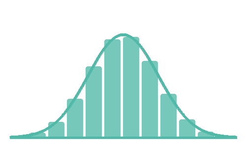

# Coming soon...

This section will comprise of necessary quantitative skills that psychologists should understand from data science, probability, statistics, and research methods.

A psychologist primarily needs to understand the **essential toolkit** for conducting quantitative research is that of **research methods**. This essentially comprises some fundamentals from **data science**, **statistics**, and **philosophy.** Here we will primarily focus upon the **quantitative** and **inferential philsophy** of applying statistical models and rudimentary data cleaning for student's in psychology to understand how to appropriately apply their understanding of the world via statistical modelling and research methods.

## What We Offer

::::::::::::: {.grid style="grid-template-columns: repeat(auto-fit, minmax(250px, 1fr)); gap: 1.5rem;"}
:::: card
::: card-body
<h3 class="card-title">

[**Mathematical Prerequisities**](case-studies/index.qmd)

</h3>

 <b>(~IN DEVELOPMENT~)</b> Learn some prerequisite skills on algebra, calculus, and lastly linear algebra for data science.

:::
::::

:::: card
::: card-body
<h3 class="card-title">

[**Probabilty Theory**](data-science/index.qmd)

</h3>

 <b>(~IN DEVELOPMENT~)</b> Learn some prerequisite skills on Probability Theory and other theories such as measure theory, spaces, conditional probability for data science.

:::
::::

:::: card
::: card-body

<h3 class="card-title">

[**Statistics**](data-science/index-2.qmd)

</h3>

 <b>(~IN DEVELOPMENT~)</b> Learn the fundamental statistical models that you need to implement from the modelling perspective

:::
::::
:::: card
::: card-body
<h3 class="card-title">

[**Research Methods**](data-science/index-3.qmd)

</h3>

 <b>(~IN DEVELOPMENT~)</b> Read this page to understand some core topics on Research methods

:::
::::
:::::::::::::

# Data-sets

The repository for most of the files for the the data-sets used in these pages can be found here: [Link](https://github.com/WU-Psychology-Technician/wrexham-psych-data)

# References

<https://teachpsych.org/E-xcellence-in-Teaching-Blog>

<https://r4ds.hadley.nz/>
