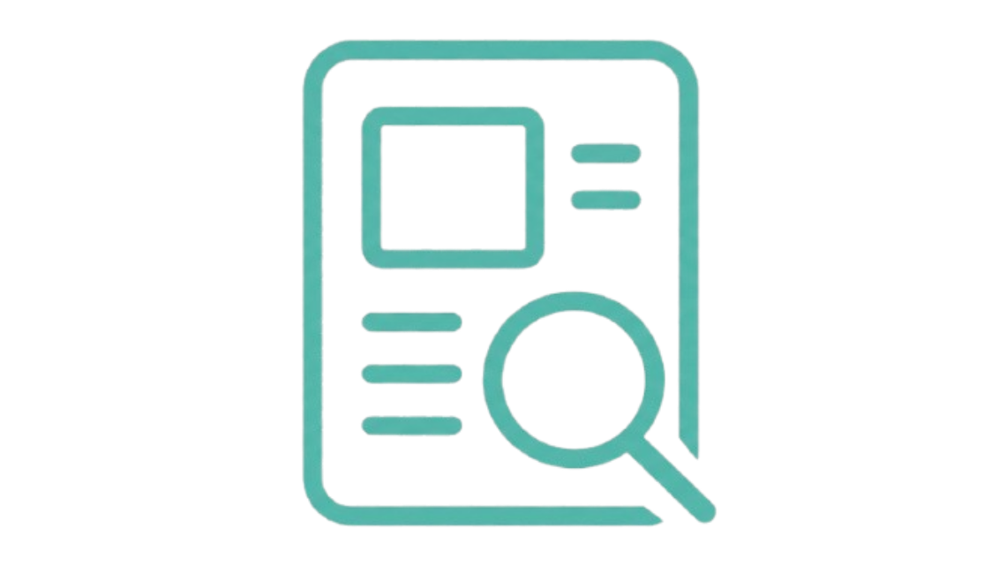

Even if you are not a dissertation student at Wrexham University, this place is a good start to understand what resources, support, and options you have for your dissertation project.

------------------------------------------------------------------------

## What We Offer

::::::::::::: {.grid style="grid-template-columns: repeat(auto-fit, minmax(250px, 1fr)); gap: 1.5rem;"}
:::: card
::: card-body
<h3 class="card-title">

[**Case Studies**](case-studies/index.qmd)

</h3>

(<b>CURRENTLY IN-DEVELOPMENT</b>) Learn about our previous dissertation projects and what they conducted for their final year.

:::
::::

:::: card
::: card-body
<h3 class="card-title">

[**SONA - Recruitment Page**](Students/SONA/index.qmd)

</h3>

(<b>CURRENTLY IN-DEVELOPMENT</b>). Learn what you can do on this page to get as many participants as possible for your dissertation project in your final year.

:::
::::

:::: card
::: card-body

<h3 class="card-title">

[**PsyTech Support**](https://outlook.office.com/book/PsychTechWrexham@MAILGLYNDWRAC.onmicrosoft.com/?ismsaljsauthenabled)

</h3>

Meet the technicians, [book time with us](https://outlook.office.com/book/PsychTechWrexham@MAILGLYNDWRAC.onmicrosoft.com/?ismsaljsauthenabled), and discover how we can help with your final year dissertation project and other modules.

:::
::::

:::: card
::: card-body
<h3 class="card-title">

[**General Ethics Guide**](ethics/index.qmd)

</h3>

Read this document to understand the ethical standards you must abide for your dissertation project

:::
::::

:::: card
::: card-body
<h3 class="card-title">

[**Online Ethics Guide**](vidatum-academic/index.qmd)

</h3>

Read this document to understand how to tackle each section of the online ethics application for your dissertation project.

:::
::::

:::: card
::: card-body
<h3 class="card-title">

[**AI Assistant**](https://gemini.google.com/gem/1_0olbGtn5J9hbwy5NDllN7PEGV0BPzIq?usp=sharing)

</h3>

Access our **PSYGEM** Learning Navigator that is trained on our strict protocols to help you on your assessments at Wrexham University.

:::
::::
:::::::::::::

-------------------------------------------------------------------------------------------------

# Data-sets

As statistics is a daunting subject for most student's, the psychology technicians have also amalgamated a repository of data-sets for teaching specific case-studies for student's attempting to learn statistics. The repository of the data-sets can be found here: [Link](https://github.com/WU-Psychology-Technician/wrexham-psych-data)

For the Wrexham psychology students who want to learn statistics please contact [psychology.technician\@wrexham.ac.uk](mailto:psychology.technician@wrexham.ac.uk). Please specify which **statistical test / model** you are attempting to fit and we will go through with you the examples we have made for you.
