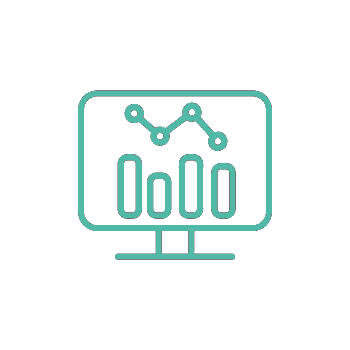

::: callout-important
# Website Maintenance

The site will be getting periodically updated before the start of the [**academic year 2026/27**]{.underline} with additional content and features.
:::

::: accent
We provide technical expertise, equipment support, and resources to students and staff in the Psychology Department at Wrexham University. More specifically, we provide technical advice to students, academics, and external clients for feasibility of projects and choosing appropriate equipment or methods to prevent bad study designs, unsafe setups, or unrealistic proposals *before* they happen.
:::

------------------------------------------------------------------------

::::::::::::: {.grid style="grid-template-columns: repeat(auto-fit, minmax(250px, 1fr)); gap: 1.5rem;"}
:::: card
::: card-body
<h3 class="card-title">

Equipment

</h3>

Learn about our available lab equipment, from EDA and eye tracking to Biopac and CANTAB. Booking information and guides included.

:::
::::
:::: card
::: card-body
<h3 class="card-title">

Resources

</h3>

Access training materials, SOPs, and tutorials on tools/platforms such as SPSS, R, Gorilla, and PsychoPy.

:::
::::

:::: card
::: card-body
<h3 class="card-title">

PsyTech Support

</h3>

Meet the technicians, book time with us, and discover how we can help with your research and teaching projects.

:::
::::

:::: card
::: card-body
<h3 class="card-title">

Booking Slots

</h3>

We provide flexible meeting slots on a daily basis. Feel free to book in to discuss your technical needs. <b> [Click here to book a meeting with us.](https://outlook.office.com/book/PsychTechWrexham@MAILGLYNDWRAC.onmicrosoft.com/?ismsaljsauthenabled)
 </b>

:::
::::
:::: card
::: card-body
<h3 class="card-title">

Student Guides

</h3>

The technicians have created guides to help students complete Risk Assessments, submit Online Ethics applications, and explore case studies showcasing the lab’s capabilities.

:::
::::

:::: card
::: card-body
<h3 class="card-title">

Data Science

</h3>

The technicians are creating guides and case studies on data science topics such as probability theory, statistics, and research methods necessary for psychology students and researchers.

:::
::::
:::::::::::::

------------------------------------------------------------------------

## Explore Our Site

To find what you need, please visit the sections above:

-   [**About**](About/index.qmd) – learn more about our role and expertise

-   [**Equipment**](Equipment/index.qmd) – discover the tools and technologies available

-   [**Students**](Students/index.qmd) - Wrexham University Final year students can publish here under the [SONA platform](Students/SONA/index.qmd) (Currently in-development) section

-   [**Resources**](Resources/index.qmd) - access open-source and academic tools

-   [**Recruitment**](recruitment/index.qmd) **-** A page to host our internal and external available studies page.

-   [**Data Science**](data-science/index.qmd) - An upcoming repository of teaching materials and instructions in regards to research methods, statistics and other quantitative applications for psychology students.

-   [**Platforms**](platforms/index.qmd)- All the main platforms the psychology department use for teaching and research.

-   [**News**](Updates/index.qmd) - get the latest news on training and short courses provided by the department

-   [**Contact**](contact/index.qmd) – get in touch with the Psychology Technicians team

------------------------------------------------------------------------

## Psychology Staff

To find the rest of the psychology staff, please see our [**full staff page**](https://wrexham.ac.uk/research/our-research/faculty-of-social-and-life-sciences/psychology--counselling/) on the main Wrexham University website.

------------------------------------------------------------------------
