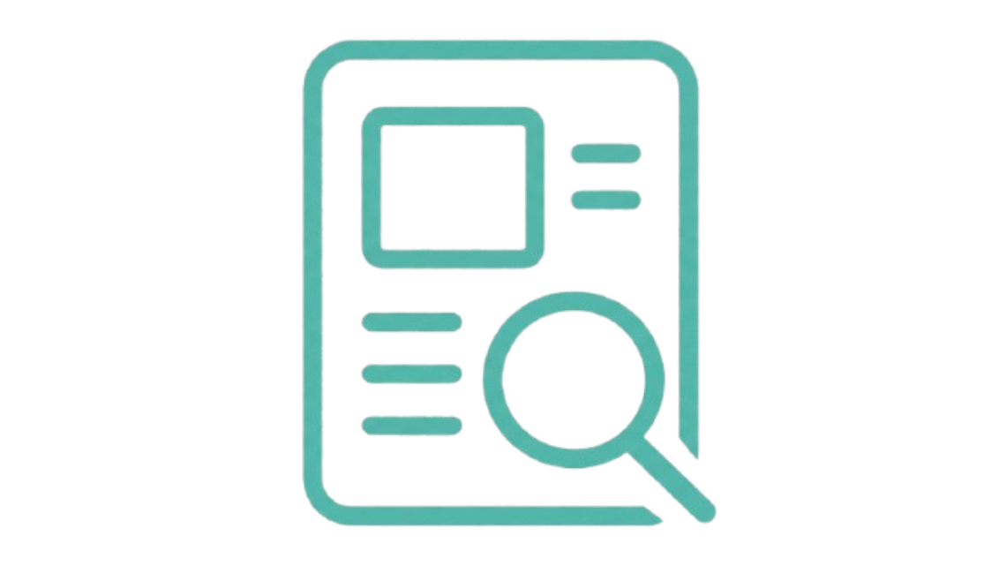
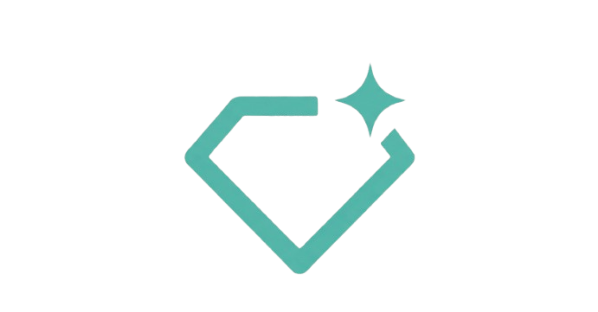

Even if you are not a dissertation student this place is still a good start to understand what resources, support, and options you have for your dissertation project.

------------------------------------------------------------------------

### PsychLabs Booker

You can book laboratories and external rooms [here](https://mailglyndwrac.sharepoint.com/:l:/s/PsychologyTechsonlyTeamspage/JACQMhm2_Hv4S6U294r1BoVWAdy4TLDU0ozzh7vXU5HsqGM?nav=ZDk0ZWE3MjUtMzk3NS00NDg2LWE5MjgtZDM5MjdlYzY3ODU4). *This booking form does not confirm a booking but* a **provisional request.** Our technicians will check room availability for your selected time and follow up shortly with confirmation or alternative times**.**

Our suite of specialist labs are dedicated to specific types of research and/or specific pieces of equipment. The use of many of these labs is restricted to those who have received appropriate training. Please speak to your module leader or project supervisor and ask them to make you known to us before you attempt to book a lab to use any specialist equipment.

If you wish for any extra resources in the room, please book those well in advance with the Psychology Technicians via Email at [psychology.technician\@wrexham.ac.uk](mailto:psychology.technician@wrexham.ac.uk). (Each room and experimental pod has a list of features that can be seen when booking the room).

------------------------------------------------------------------------

### PsychTech Booking System

You can book services provided by the Technicians based on our availability [here](https://bookings.cloud.microsoft/book/PsychTechWrexham@MAILGLYNDWRAC.onmicrosoft.com/?ismsaljsauthenabled).

Our open bookings are based on our availability of our calendars. Please do not request if we can change our availability to accommodate you. This is the reason why we have chosen this booking system so you can flexibly select time blocks appropriately in accordance to our work schedule and your own as we are trying to help everyone who has requested help through all levels within our available work hours. We will also delineate each service available to you here below

- **Initial Discussion -** If you are thinking of doing a technical project for your dissertation then come and speak to us so you can understand what we can help with!

- **Gorilla Support -** If you need help with the initial steps of your experiment or solving some quick technical difficulty on the site then book this service.

- **JISC Support -** If you need help with the initial steps of your survey or solving some quick technical difficulty on the site then book this service.

- **Panopto Support -** If you need help with the initial steps of your interview or solving some quick technical difficulty on the site then book this service.

- **Technical Meeting -** For projects with a lot of building and programming necessary to be implemented into your project, book this service

- **Equipment Collection** / **Return** - To pick up or return equipment for specific modules or dissertations projects, book this service.

- **Equipment Training -** To use any specialised equipment will need necessary H&S, Risk Assessment, and training to use the equipment then book this service. This will have to be booked 1 week in advanced for the technicians to prepare the necessary documents and equipment setup.

- **Data Cleaning -** For any difficulties in your initial data cleanup of your quantitative project. Please book this service.

Please see the FAQ in the About section as I have also pointed out (or the technician handbook on the Moodle page) to delineate what we *cannot* help with.

------------------------------------------------------------------------

## What Else We Offer

::::::::::::::: {.grid style="grid-template-columns: repeat(auto-fit, minmax(250px, 1fr)); gap: 1.5rem;"}
:::: card
::: card-body
<h3 class="card-title">

[**Case Studies**](case-studies/index.qmd)

</h3>

<p>Learn about our previous dissertation projects and what they conducted for their final year.</p>

```{=html}

```
:::
::::

:::: card
::: card-body
<h3 class="card-title">

[**SONA**](Students/SONA/index.qmd)

</h3>

<p>(<b>CURRENTLY IN-DEVELOPMENT</b>)</p>

```{=html}

```
:::
::::

:::: card
::: card-body
<h3 class="card-title">

[**PsyTech Support**](https://outlook.office.com/book/PsychTechWrexham@MAILGLYNDWRAC.onmicrosoft.com/?ismsaljsauthenabled)

</h3>

<p>Meet the technicians, [**book time with us**](https://outlook.office.com/book/PsychTechWrexham@MAILGLYNDWRAC.onmicrosoft.com/?ismsaljsauthenabled), and discover how we can help with your final year dissertation project and other modules. Even if you are not a final year student (Lv6), this site still can offer insight</p>

```{=html}

```
:::
::::

:::: card
::: card-body
<h3 class="card-title">

[**General Ethics Guide**](ethics/index.qmd)

</h3>

<p>Read this document to understand the ethical standards you must abide for your dissertation project</p>

```{=html}

```
:::
::::

:::: card
::: card-body
<h3 class="card-title">

[**Online Ethics Guide**](vidatum-academic/index.qmd)

</h3>

<p>Read this document to understand how to tackle each section of the online ethics application for your dissertation project.</p>

```{=html}

```
:::
::::

:::: card
::: card-body
<h3 class="card-title">

[**AI Assistant**](https://gemini.google.com/gem/1_0olbGtn5J9hbwy5NDllN7PEGV0BPzIq?usp=sharing)

</h3>

<p>Access our **PSYCHGEM** Learning Navigator that is trained specifically to guide you on how to approach your assessments at Wrexham University.</p>

```{=html}

```
:::
::::
:::::::::::::::

------------------------------------------------------------------------

If you need help or information regarding specific resources such as JISC, Gorilla.sc, Panopto then please see the Platforms section of our webpage.
